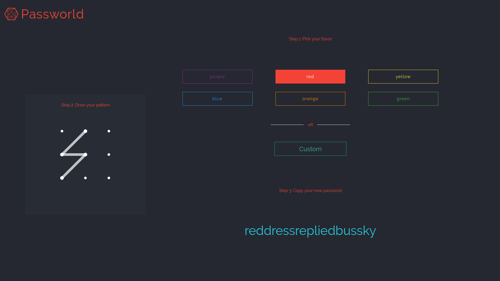

# Passworld
Passworld is a static, mobile-ready, AngularJS powered password generator.




  - Generates passwords for humans
  - Colorful customisation options


You can also:
  - remember your new passwords
  - personalize your password


> "Fantastic, I'm totally blown away by Passworld."  - Neil L.

and

> "This is unbelievable. After using Passworld my buisness skyrocketed!" -  Valmik J.


### Tech

Passworld uses a number of open source projects to work properly:

* [patternLock](https://github.com/s-yadav/patternLock) - A light weight plugin to simulate a pattern lock interface

* [AngularJS] - HTML enhanced for web apps!

* [jQuery] - duh


### Installation
```sh
$ git clone git@github.com:ayushs08/passworld.git
```
or
```sh
$ git clone https://github.com/ayushs08/passworld.git 
```

Open index.html in your preferred browser to run the application.


License
----

MIT


**Free Software, Hell Yeah!**

[//]: # 


   
   [jQuery]: <http://jquery.com>
   [AngularJS]: <http://angularjs.org>
 
